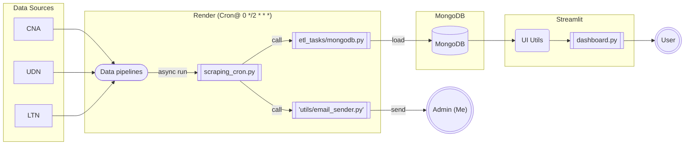
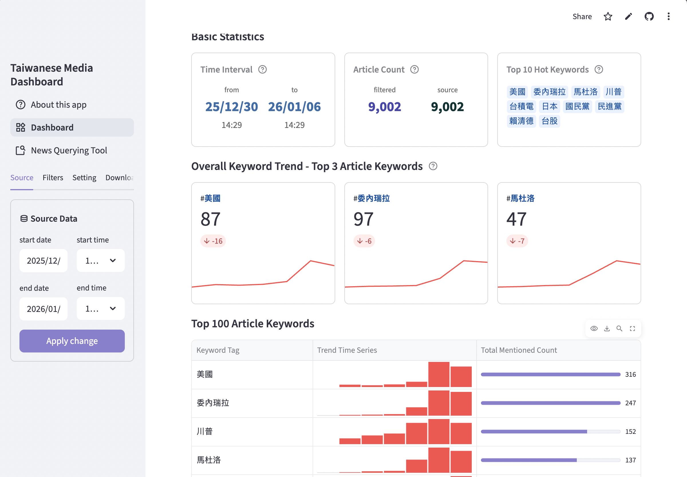
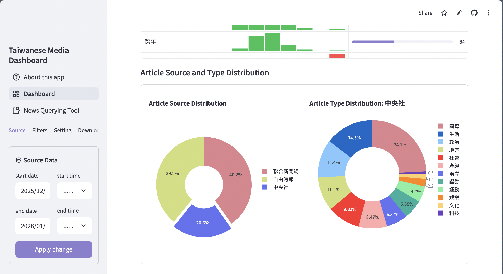
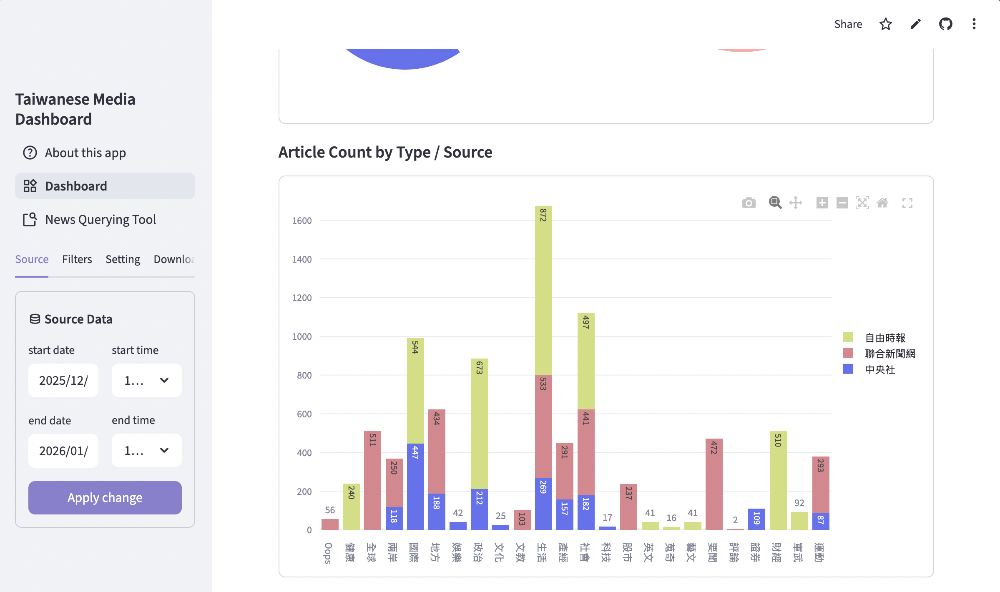
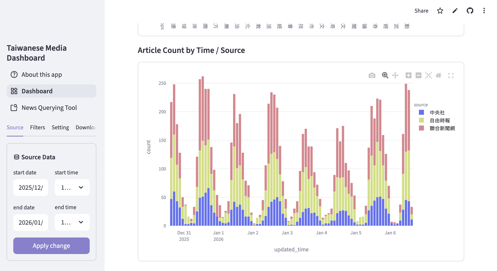
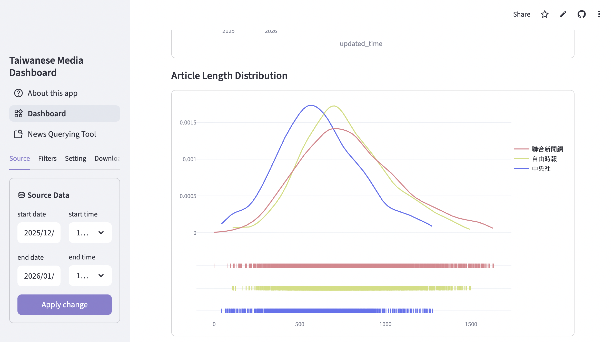
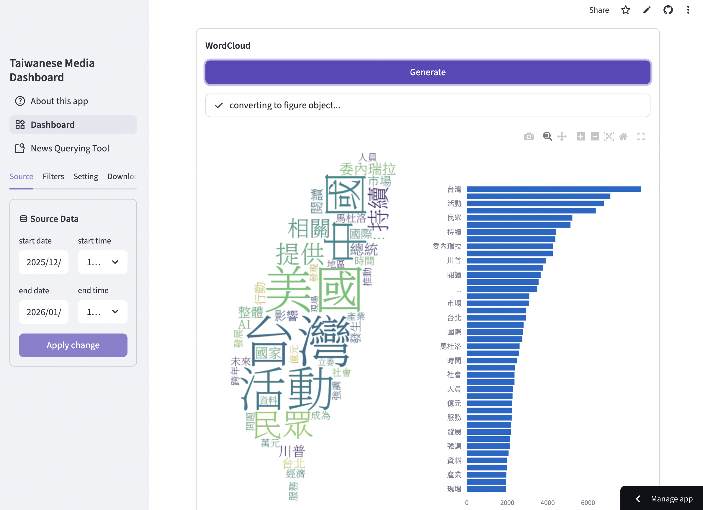
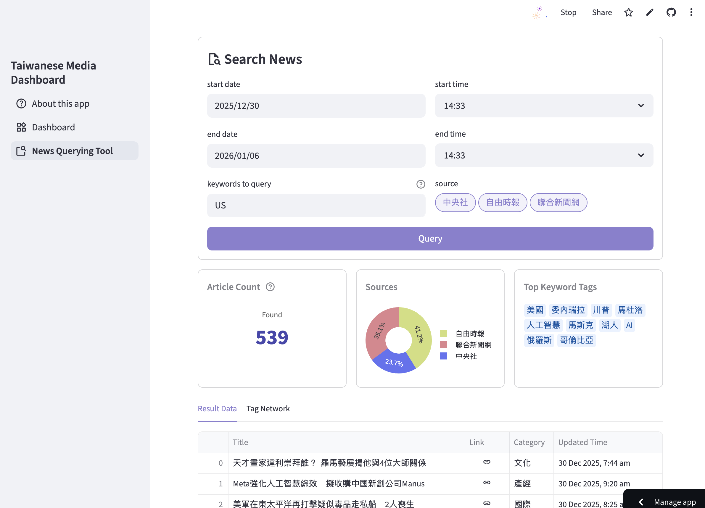
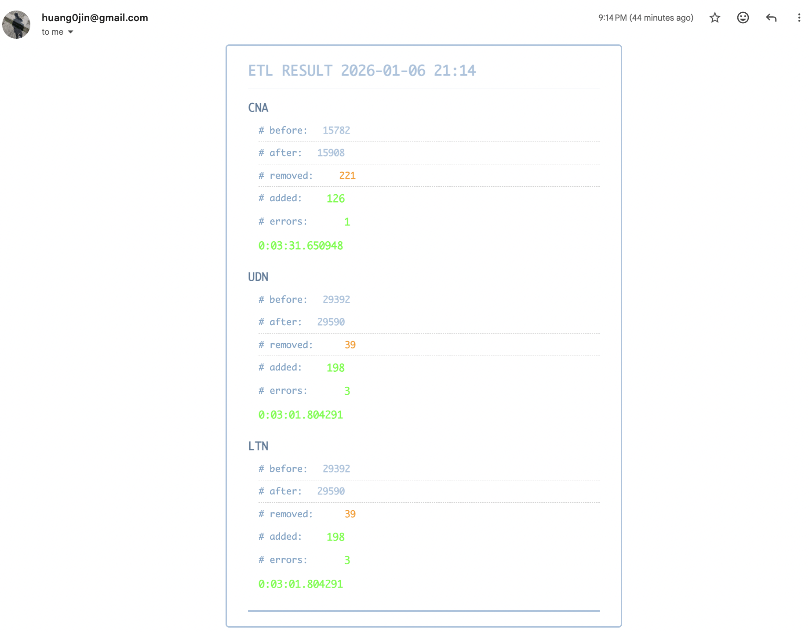

# Taiwanese Media Analytics Pipelines and Dashboard
> In light of the absense of a database that stores Taiwanese news in a pool, I designed data pipeline and a streamlit UI to enhance the access to Taiwanese news data, especially for data scientists and NLP specialists. 
> This data engineering project automates and schedules the process of dynamic webscraping from three main media in Taiwan: CNA (中央社), UDN (聯合新聞網), and LTN (自由時報). 

📍Visit the dashboard [here](https://taiwan-media-dashboard-tool.streamlit.app/)!

## Technology
|Aspect | Technology |
| -- | -- |
| Language | Python |
| Web Scraping | Selenium, BeautifulSoup |
| Database | MongoDB ([MongoDB Atlas Database](https://www.mongodb.com/products/platform/atlas-database)) |
| Back-end (Pipeline) Cloud | [Render Cloud](https://render.com/) |
| User Interface | Streamlit | 
| Front-end Cloud | [Streamlit Cloud Platform](https://streamlit.io/) |

## Architecture 

## User Interface
### Dashboard
#### Article Keyword Trends

#### Article Source and Type Distribution

#### Article Count by Type and Source

#### Article Count by Time and Source

#### Length Distribution

#### Wordcloud

### News Querying Tool

## Pipeline Design
### Batch Data Pipeline with Low Cost
> Utilizing the beginner plan on Render Cloud, the pipeline was deployed using the `cronjob` web service, which features a pay-as-you-go model. In my case, running the pipelines every two hours only takes me 1 USD per month.
> 
### Concurrent Scraping
> The data pipeline is designed to concurrently scrape news data from the three distinctive media webpages, which saves tremendous amount of time. 

### Dynamic Data Cleaning
> In order not to exceed the maximum storage amount of MongoDB Atlas free-tier, the pipelines delete news data prior to six months ago automatically. 

### Email Notification
> Email is sent to the admin (me) to notify the number of appened and removed news data in the database every time the pipeline is run. When the pipeline fails, email containing the error message is also sent to me.
